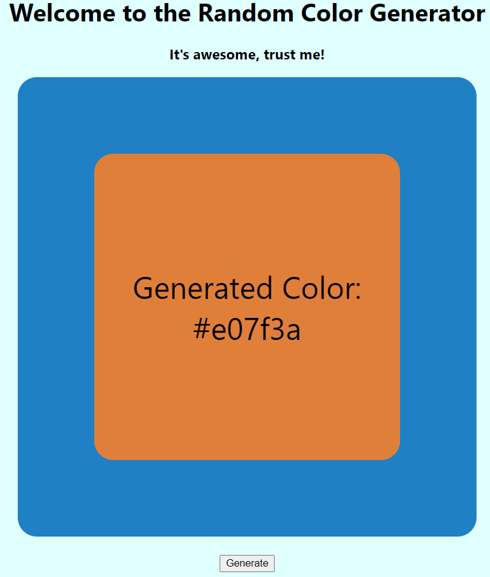
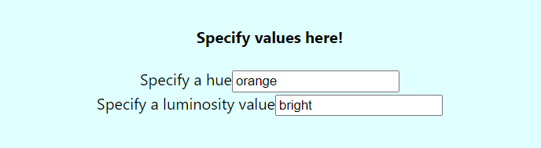

# react-random-color-generator

Welcome to my random color generator using React!
This is pretty straight forward, the box will be colored in a random color everytime the user presses the "Generate" button.
The box itself is composed of two different boxes:

- the inner box is the one getting colored with the color displayed
- the outer box on the other hand is the inverse color to provide some contrast.

The user may also change the hue and luminosity values.

If the user does not enter a valid value or leaves it blank, the random color generator will still work and generate a random color!
